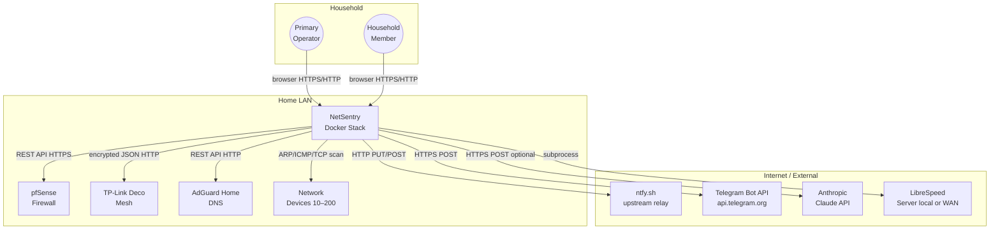
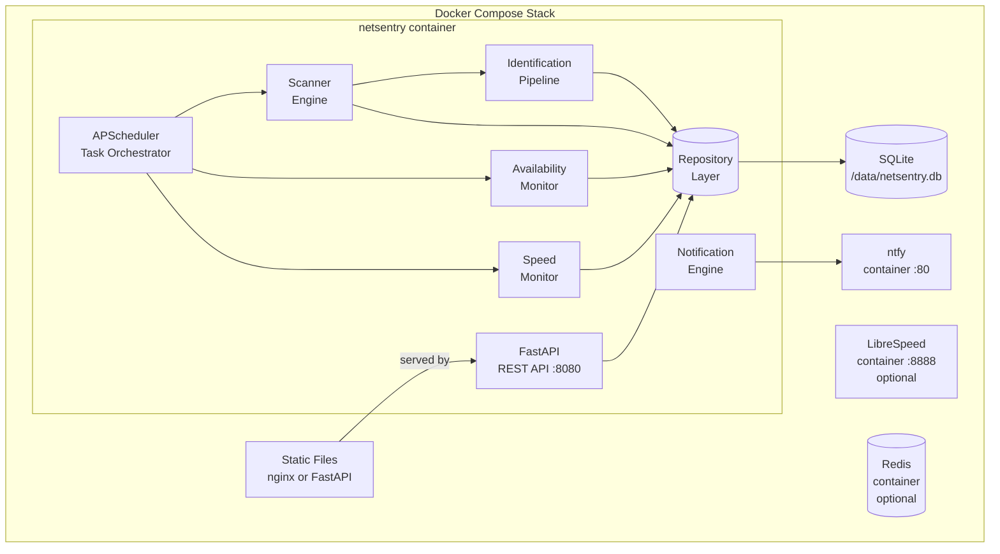

# Technical Requirements Document

**Project:** NetSentry
**Version:** 1.0
**Status:** Draft
**Last Updated:** 2026-03-21
**PRD Reference:** [PRD](./prd.md)

---

## 1. Executive Summary

### Purpose
This TRD translates the NetSentry PRD into concrete technical decisions: architecture pattern, technology stack, API contracts, data schema, integration protocols, container topology, and security controls. It is the authoritative technical reference for all implementation work and the basis for Epic and Story generation.

### Scope
Covers the full NetSentry Docker Compose stack: Scanner Engine, Identification Pipeline (including AI enrichment), Availability Monitor, Speed Monitor, pfSense / Deco / AdGuard integrations, Notification Engine (ntfy + Telegram), REST API, and React frontend. Excludes FW_agent integration (Phase 5), voice interface (Phase 5), and any external deployment infrastructure (NetSentry is a self-hosted home network appliance).

### Key Decisions
- **Modular monolith** within a single Python process; not microservices — justified by home network scale, single-operator deployment, and operational simplicity
- **SQLite + aiosqlite** as the primary data store — sufficient for ≤200 devices, zero-config, single-file backup
- **FastAPI** for the REST API — async-native, auto-generates OpenAPI docs, strong Pydantic integration for schema validation
- **APScheduler** for all periodic tasks (scans, polls, availability probes, speed tests) — in-process, no external broker required
- **LibreSpeed** as the default speed test backend — self-hosted, no licence restrictions, privacy-preserving
- **Telegram** notifications via plain `sendMessage` API only (v1.0) — no bot polling loop; inline keyboard deferred
- **Docker host networking** for the scanner container — required for Layer 2 ARP access; `CAP_NET_RAW` scoped to scanner only
- **AI identification disabled by default** — opt-in only, requires explicit `ENABLE_AI_IDENTIFICATION=true` and `ANTHROPIC_API_KEY`

---

## 2. Project Classification

**Project Type:** Web Application (full-stack, self-hosted appliance)

**Classification Rationale:** NetSentry has both a React SPA frontend and a Python REST API backend, deployed together as a Docker Compose stack on a single host. It serves a local web UI and exposes a REST API consumed by that UI. There is no mobile native app; all mobile access is via the responsive web UI.

**Architecture Implications:**
- **Default Pattern:** Modular Monolith (single deployable unit with internal module boundaries)
- **Pattern Used:** Modular Monolith
- **Deviation Rationale:** Not applicable. Microservices would add operational complexity (inter-service networking, distributed tracing, multiple process managers) entirely unjustified at home network scale with a single operator. All modules (scanner, integrations, monitor, speed test, notifications, API) run within one Python process managed by APScheduler and FastAPI. The frontend is a separate build artifact served as static files by FastAPI or a co-deployed nginx container.

---

## 3. Architecture Overview

### System Context
NetSentry runs on a Docker host on the home LAN, positioned to see all network devices. It actively probes the local network and polls three integration targets (pfSense, TP-Link Deco, AdGuard Home). It pushes alerts outbound to ntfy (local) and Telegram (internet). Optionally it calls the Anthropic Claude API for device identification enrichment and the LibreSpeed server (local) or Speedtest.net (internet) for speed tests. Household members access the web UI from any LAN device via a browser.

### Architecture Pattern
**Modular Monolith** — a single Python process with clearly separated internal modules, each with defined responsibilities and interfaces. Modules communicate via direct Python function calls and a shared SQLite database (mediated by a repository layer). APScheduler orchestrates all periodic work within the same process.

**Rationale:** At home network scale (≤200 devices, single operator, single host), microservices would impose distributed systems complexity with no benefit. A monolith with strong internal module boundaries gives the same separation of concerns at a fraction of the operational cost. The codebase remains navigable, debuggable, and deployable as a single Docker image.

### Component Overview

| Component | Responsibility | Technology |
|-----------|---------------|------------|
| Scanner Engine | ARP/ICMP/TCP/mDNS/SSDP/NetBIOS network discovery | Python, nmap, arp-scan, scapy, fping |
| Identification Pipeline | Multi-source device fingerprinting + optional AI enrichment | Python, heuristic rules, Anthropic SDK |
| Enrichment Engine | Merges all data sources into unified device record | Python (internal module) |
| Deco Integration | Polls TP-Link Deco local API for mesh/client data | Python (httpx, custom encrypted JSON client) |
| pfSense Integration | Polls pfSense REST API + SSH fallback | Python (httpx, paramiko) |
| AdGuard Integration | Polls AdGuard Home REST API for DNS data | Python (httpx) |
| Availability Monitor | High-frequency per-device up/down probing | Python (asyncio ICMP/TCP/HTTP probes) |
| Speed Monitor | Scheduled internet speed tests | Python (subprocess: librespeed-cli / speedtest-cli) |
| Event Engine | Detects state changes, generates Events, dispatches alerts | Python (internal module) |
| Notification Engine | Routes alerts to ntfy, Telegram, Apprise | Python (httpx, apprise) |
| Repository Layer | All SQLite reads/writes via typed async repository classes | Python (aiosqlite, dataclasses) |
| REST API | HTTP endpoints for UI and external consumers | FastAPI, Pydantic v2 |
| Task Scheduler | Orchestrates all periodic tasks | APScheduler 3.x (AsyncIOScheduler) |
| Web Frontend | React SPA — dashboard, device management, settings | React 18, TypeScript, Vite, shadcn/ui, Tailwind CSS |

### Architecture Diagrams

#### System Context (C4 L1)



#### Container Diagram (C4 L2)



---

## 4. Technology Stack

### Core Technologies

| Category | Technology | Version | Rationale |
|----------|-----------|---------|-----------|
| Language | Python | 3.12+ | Rich async networking libraries (scapy, asyncio), mature nmap/paramiko ecosystem, rapid development; no strong reason to use a compiled language for home network scale |
| Web Framework | FastAPI | 0.115+ | Async-native (critical for non-blocking scanner + API coexistence), auto-generates OpenAPI/Swagger docs, first-class Pydantic v2 integration for schema validation, excellent performance |
| Schema Validation | Pydantic | v2 | Co-requirement with FastAPI; strict type enforcement at API boundary and in repository layer |
| Database | SQLite | 3.45+ | Zero-config, single-file, ACID-compliant, adequate for ≤200 devices and all time-series tables. No Postgres/MySQL operational overhead justified at home scale |
| Async DB Driver | aiosqlite | 0.20+ | Non-blocking SQLite access required for FastAPI async compatibility; prevents I/O from blocking the event loop |
| Task Scheduler | APScheduler | 3.x (AsyncIOScheduler) | In-process async scheduler, no external broker (Redis/RabbitMQ) needed, rich cron/interval/date triggers, integrates cleanly with asyncio event loop |
| HTTP Client | httpx | 0.27+ | Async HTTP client required for non-blocking integration polling; clean API, timeout/retry support, used for pfSense, AdGuard, ntfy, Telegram, Claude API calls |
| SSH Client | paramiko | 3.x | Industry-standard Python SSH library; used for pfSense SSH fallback (existing pfsense_proxy.py pattern) |
| Network Scanning | nmap (python-nmap) | 7.94+ / 1.6+ | Industry standard for port scanning, OS fingerprinting, service detection; no viable Python-native alternative at this capability level |
| Layer 2 Scanning | scapy | 2.5+ | ARP packet crafting and capture; required for direct Layer 2 device discovery independent of routing |
| ARP Scan | arp-scan | 1.10+ | Fastest ARP sweeper available; complements scapy for broad subnet discovery |
| ICMP Sweep | fping | 5.x | Parallel ICMP ping sweep; far faster than sequential ping for /24 subnet sweeps |
| Multi-channel Notifications | Apprise | 1.9+ | 80+ notification services behind a single API; used as tertiary notification channel |
| AI SDK | anthropic | 0.25+ | Official Anthropic Python SDK; only installed when `ENABLE_AI_IDENTIFICATION=true` |
| Frontend Language | TypeScript | 5.x | Type safety in the React codebase; catches integration bugs between frontend and API types at compile time |
| Frontend Framework | React | 18.x | Industry standard SPA framework; broad ecosystem for data visualisation components (Recharts, react-flow) |
| Frontend Build | Vite | 5.x | Fast HMR in development, optimised production builds, native TypeScript support |
| UI Components | shadcn/ui + Tailwind CSS | latest | Accessible, composable component library; Tailwind gives utility-first styling without a CSS-in-JS runtime overhead |

### Build & Development

| Tool | Purpose |
|------|---------|
| Docker + Docker Compose v2 | Container orchestration for the full stack |
| uv (Astral) | Python package management and virtual environment (fast, deterministic lockfile) |
| pnpm | Node.js package management for frontend (faster than npm, deterministic) |
| pytest + pytest-asyncio | Python test framework with async test support |
| Vitest | Frontend unit and component testing (Vite-native, fast) |
| ruff | Python linter and formatter (replaces flake8 + black + isort) |
| mypy | Static type checking for Python codebase |
| pre-commit | Git hooks for lint/format/type-check on commit |
| Alembic | SQLite schema migration management |

### Infrastructure Services

| Service | Provider | Purpose |
|---------|----------|---------|
| ntfy | Self-hosted Docker container (binwiederhier/ntfy) | Primary push notification delivery to Android/iOS |
| LibreSpeed server | Self-hosted Docker container (linuxserver/librespeed) | Self-hosted speed test endpoint; privacy-preserving alternative to Ookla |
| Redis | Self-hosted Docker container (redis:alpine) | Optional hot-data cache; enabled via `ENABLE_REDIS_CACHE=true` when device count >150 |

---

## 5. API Contracts

### API Style
REST (JSON over HTTP/HTTPS). No GraphQL — query complexity does not justify it at this scale. No WebSocket in v1.0 — the React SPA polls the REST API on a configurable interval (default: 10 seconds for dashboard updates). Server-Sent Events (SSE) considered for real-time event streaming as a Phase 2 enhancement.

### Authentication
**LAN-only, no auth by default.** The API is only exposed on the Docker host's LAN interface. An optional simple API key header (`X-API-Key`) can be enabled for users who expose the UI via a reverse proxy. No OAuth/JWT required for a single-operator home appliance. Basic auth for the REST API may be added as an optional hardening step in a future version.

### API Versioning
All endpoints are prefixed `/api/v1/`. No versioning complexity beyond this prefix for v1.0.

### Endpoints Overview

**Devices**

| Method | Path | Description |
|--------|------|-------------|
| GET | /api/v1/devices | List devices (default: active only; `?lifecycle=historic` for archived) |
| GET | /api/v1/devices/{mac} | Get single device with full enrichment |
| PATCH | /api/v1/devices/{mac} | Update friendly_name, category, subcategory, owner, notes, lifecycle |
| DELETE | /api/v1/devices/{mac} | Permanent delete (requires `confirm=<mac>` query param) |
| GET | /api/v1/devices/{mac}/history | IP assignment and event history |
| GET | /api/v1/devices/{mac}/ports | Port scan history |
| GET | /api/v1/devices/{mac}/dns | DNS profile data |
| GET | /api/v1/devices/{mac}/identification | Identification results with signal breakdown |

**Scanning**

| Method | Path | Description |
|--------|------|-------------|
| POST | /api/v1/scan/trigger | Trigger on-demand scan (`body: {profile: "quick"|"standard"|"deep"}`) |
| GET | /api/v1/scan/status | Last scan run metadata and current scan state |
| GET | /api/v1/scan/runs | Scan run history |

**Availability Monitoring**

| Method | Path | Description |
|--------|------|-------------|
| GET | /api/v1/availability | List all monitored devices with current state |
| GET | /api/v1/availability/{mac} | Uptime stats and event history for a device |
| POST | /api/v1/availability/{mac}/enable | Enable monitoring (`body: {interval_seconds, probe_method, probe_port}`) |
| DELETE | /api/v1/availability/{mac} | Disable monitoring |

**Speed Tests**

| Method | Path | Description |
|--------|------|-------------|
| GET | /api/v1/speedtest/results | Speed test history (`?limit=100&range=7d`) |
| GET | /api/v1/speedtest/latest | Most recent result |
| POST | /api/v1/speedtest/trigger | Trigger on-demand speed test |

**Events & Notifications**

| Method | Path | Description |
|--------|------|-------------|
| GET | /api/v1/events | Event log (`?device_mac=&type=&severity=&limit=100`) |
| POST | /api/v1/notifications/test/{channel} | Send test notification to `ntfy`, `telegram`, or `apprise` |
| GET | /api/v1/notifications/config | Current notification channel config (redacted credentials) |

**Integrations & System**

| Method | Path | Description |
|--------|------|-------------|
| GET | /api/v1/deco/topology | Deco mesh: all nodes + connected clients |
| GET | /api/v1/pfsense/status | pfSense gateway health + system info |
| GET | /api/v1/adguard/status | AdGuard filter status + top stats |
| GET | /api/v1/system/health | Overall system health: DB, integrations, scheduler |
| GET | /api/v1/system/config | Runtime configuration (redacted secrets) |

### Error Response Format
```json
{
  "error": {
    "code": "DEVICE_NOT_FOUND",
    "message": "No device found with MAC address aa:bb:cc:dd:ee:ff",
    "details": {}
  }
}
```

HTTP status codes: 200 OK, 201 Created, 204 No Content, 400 Bad Request, 404 Not Found, 409 Conflict, 422 Unprocessable Entity, 500 Internal Server Error.

### Device PATCH Schema
```json
{
  "friendly_name": "Ian's MacBook Pro",
  "category": "Personal Device",
  "subcategory": "Laptop",
  "owner": "Ian",
  "notes": "Primary work machine. Static DHCP lease.",
  "lifecycle": "active"
}
```
All fields optional. `lifecycle` accepted values: `active`, `historic`. `deleted` is set only via `DELETE /devices/{mac}`.

---

## 6. Data Architecture

### Schema Design Principles
- MAC address (`aa:bb:cc:dd:ee:ff`, lowercase, colon-separated) is the canonical device identifier and primary key for the `devices` table.
- All timestamps stored as ISO-8601 UTC strings in SQLite TEXT columns (SQLite has no native DATETIME type; aiosqlite returns strings, which are parsed to `datetime` in the repository layer).
- JSON blobs (e.g., `top_domains`, `details`, `reasoning`) stored in TEXT columns and serialised/deserialised in the repository layer.
- No foreign key enforcement at the SQLite level for performance; referential integrity enforced in the repository layer.

### Core Data Models

#### devices
| Field | Type | Constraints | Description |
|-------|------|-------------|-------------|
| mac_address | TEXT | PK | Canonical device identifier (lowercase, colon-separated) |
| friendly_name | TEXT | NULLABLE | User-assigned display name |
| category | TEXT | NULLABLE | Controlled vocabulary category |
| subcategory | TEXT | NULLABLE | Controlled vocabulary or custom subcategory |
| owner | TEXT | NULLABLE | Free text owner name |
| notes | TEXT | NULLABLE | Markdown notes |
| vendor | TEXT | NULLABLE | IEEE OUI manufacturer |
| device_type | TEXT | NULLABLE | Auto-classified type |
| os_family | TEXT | NULLABLE | OS family (e.g., "iOS", "Tizen", "Windows") |
| os_version | TEXT | NULLABLE | OS version string |
| current_ip | TEXT | NULLABLE | Most recently seen IP address |
| hostname | TEXT | NULLABLE | Primary resolved hostname |
| lifecycle | TEXT | DEFAULT 'active' | 'active', 'historic', 'deleted' |
| connection_type | TEXT | NULLABLE | 'wired' or 'wireless' |
| first_seen | TEXT | NOT NULL | ISO-8601 UTC timestamp |
| last_seen | TEXT | NOT NULL | ISO-8601 UTC timestamp |
| is_online | INTEGER | DEFAULT 0 | 1 = online, 0 = offline |
| is_monitored | INTEGER | DEFAULT 0 | 1 = availability monitoring active |
| created_at | TEXT | NOT NULL | Record creation timestamp |
| updated_at | TEXT | NOT NULL | Last update timestamp |

#### ip_assignments
| Field | Type | Description |
|-------|------|-------------|
| id | INTEGER PK | Auto-increment |
| mac_address | TEXT | FK → devices |
| ip_address | TEXT | IP address |
| source | TEXT | 'dhcp', 'arp', 'scan', 'deco' |
| first_seen | TEXT | ISO-8601 UTC |
| last_seen | TEXT | ISO-8601 UTC |

#### identification_results
| Field | Type | Description |
|-------|------|-------------|
| id | INTEGER PK | Auto-increment |
| mac_address | TEXT | FK → devices |
| source | TEXT | 'heuristic', 'ai', 'manual' |
| product_type | TEXT | Identified product type |
| os_family | TEXT | OS family |
| os_version | TEXT | OS version |
| manufacturer | TEXT | Manufacturer |
| model_guess | TEXT | Model estimate |
| confidence | REAL | 0.0–1.0 confidence score |
| reasoning | TEXT | JSON: signal breakdown or AI reasoning string |
| manually_set | INTEGER | 1 = manual override; never auto-overwritten |
| created_at | TEXT | ISO-8601 UTC |

#### availability_monitors
| Field | Type | Description |
|-------|------|-------------|
| mac_address | TEXT PK | FK → devices |
| enabled | INTEGER | 1 = active |
| interval_seconds | INTEGER | Probe interval (min 10) |
| probe_method | TEXT | 'icmp', 'tcp', 'http' |
| probe_port | INTEGER NULLABLE | TCP port for 'tcp' method |
| probe_url_path | TEXT NULLABLE | URL path for 'http' method |
| consecutive_failures_threshold | INTEGER | Default 2 |
| current_state | TEXT | 'up', 'down', 'unknown' |
| last_probe_at | TEXT | ISO-8601 UTC |
| last_state_change_at | TEXT NULLABLE | ISO-8601 UTC |

#### availability_events
| Field | Type | Description |
|-------|------|-------------|
| id | INTEGER PK | Auto-increment |
| mac_address | TEXT | FK → devices |
| state | TEXT | 'up' or 'down' |
| timestamp | TEXT | ISO-8601 UTC |
| duration_seconds | INTEGER NULLABLE | Outage duration (set on recovery) |

#### speed_test_results
| Field | Type | Description |
|-------|------|-------------|
| id | INTEGER PK | Auto-increment |
| download_mbps | REAL | Download speed |
| upload_mbps | REAL | Upload speed |
| ping_ms | REAL | Latency |
| jitter_ms | REAL NULLABLE | Jitter |
| packet_loss_pct | REAL NULLABLE | Packet loss % |
| server_name | TEXT NULLABLE | Test server name |
| server_location | TEXT NULLABLE | Test server location |
| backend | TEXT | 'librespeed', 'ookla', 'fast' |
| tested_at | TEXT | ISO-8601 UTC |

#### events
| Field | Type | Description |
|-------|------|-------------|
| id | INTEGER PK | Auto-increment |
| mac_address | TEXT NULLABLE | FK → devices (NULL for system events) |
| event_type | TEXT | e.g., 'device.new', 'device.offline', 'availability.down', 'speed.threshold_breach' |
| severity | TEXT | 'urgent', 'high', 'info' |
| details | TEXT | JSON blob of event-specific data |
| notification_sent | INTEGER | 1 = notification dispatched |
| timestamp | TEXT | ISO-8601 UTC |

#### notifications
| Field | Type | Description |
|-------|------|-------------|
| id | INTEGER PK | Auto-increment |
| event_id | INTEGER | FK → events |
| channel | TEXT | 'ntfy', 'telegram', 'apprise' |
| status | TEXT | 'sent', 'failed', 'suppressed' |
| priority | TEXT | 'urgent', 'high', 'default' |
| sent_at | TEXT NULLABLE | ISO-8601 UTC |
| error | TEXT NULLABLE | Error message on failure |

#### deletion_audit_log
| Field | Type | Description |
|-------|------|-------------|
| id | INTEGER PK | Auto-increment |
| mac_address | TEXT | Deleted device MAC (retained permanently) |
| deleted_at | TEXT | ISO-8601 UTC |
| friendly_name_at_deletion | TEXT NULLABLE | Name at time of deletion |

### Storage Strategy

| Data Type | Storage | Rationale |
|-----------|---------|-----------|
| Device inventory + all sub-records | SQLite | Zero-config, single-file, ACID. Sufficient for home network scale |
| Speed test history | SQLite (speed_test_results) | Low write frequency (every 6h default); 365-day retention = ~1460 rows/year |
| Availability history | SQLite (availability_events) | Higher frequency but only for opted-in devices (≤50); 90-day rolling window |
| OUI vendor database | Wireshark manuf flat file on Docker volume | ~40MB, refreshed weekly via HTTP GET |
| AI identification cache | SQLite or JSON file (keyed by signal fingerprint hash) | Prevents re-calling AI API for identical signal sets |
| Hot device state cache | Redis (optional) | Only enabled beyond 150 devices; reduces SQLite reads for frequent API polling |
| Integration credentials | Docker secrets (mounted files) | Never in DB or environment variables in plain text |

### Migrations
Alembic manages all schema migrations. Initial schema created in migration `0001_initial.py`. Each feature branch that touches the schema creates a new numbered migration. Migrations run automatically at container startup before the FastAPI server accepts connections. Downgrade scripts included for all migrations.

---

## 7. Integration Patterns

### External Services

| Service | Protocol | Auth | Polling Interval | Retry Strategy |
|---------|---------|------|-----------------|----------------|
| pfSense REST API | HTTPS REST (pfrest.org v2, v1 fallback) | Bearer token (Docker secret) | 30s | 3 retries, exponential backoff (1s, 2s, 4s); SSH fallback on persistent failure |
| pfSense SSH fallback | SSH (paramiko) | Key-based auth (existing pfsense_proxy.py pattern) | On REST failure | 2 retries; logs warning if both fail |
| TP-Link Deco local API | HTTP (encrypted JSON) | Owner credentials (Docker secret); session token refreshed on 403 | 30s | 2 retries; re-auth on 403; degrade gracefully to scanner-only on persistent failure |
| AdGuard Home REST | HTTP REST (/control/*) | Basic Auth (Docker secret) | 60s | 3 retries, exponential backoff |
| ntfy | HTTP PUT/POST | Bearer token optional | On event | 3 retries; failure logged, non-fatal |
| Telegram Bot API | HTTPS POST to api.telegram.org | Bot token (Docker secret) | On event | 3 retries, 5s delay; failure logged, non-fatal |
| Anthropic Claude API | HTTPS POST | API key (Docker secret) | On identification trigger (max 10/cycle) | 2 retries; non-fatal on failure; heuristic result used |
| LibreSpeed server | subprocess (librespeed-cli) | None | Configurable (default 6h) | Skip + log on unreachable; no alert |
| Ookla Speedtest.net | subprocess (speedtest-cli) | None / Ookla account token | Configurable (default 6h) | Skip + log on unreachable |
| IEEE OUI database | HTTP GET (Wireshark manuf URL) | None | Weekly background refresh | 3 retries; use cached file on failure |

### Integration Module Design
Each integration (pfSense, Deco, AdGuard) is a standalone Python module under `netsentry/integrations/` with a consistent interface:

```python
class BaseIntegration(ABC):
    async def connect(self) -> bool: ...
    async def poll(self) -> IntegrationResult: ...
    async def health_check(self) -> HealthStatus: ...
    async def disconnect(self) -> None: ...
```

The Enrichment Engine calls each integration's `poll()` method and passes results to the Repository Layer. If `poll()` raises `IntegrationUnavailableError`, the Engine logs the failure and continues with stale data, marking the integration as unhealthy in `SystemConfig`.

### Event Architecture
Events are generated in-process by the Event Engine module. There is no message queue in v1.0 — event generation and notification dispatch happen synchronously within the same APScheduler task invocation. This is acceptable at home network scale where event volume is low (<<100 events/day typical). A message queue (Redis Streams or similar) can be added in a future version if event throughput requires it.

Event flow:
```
Scanner/Monitor/SpeedTest detects state change
    → Event Engine creates Event record in DB
    → Event Engine evaluates alert rules (severity, quiet hours, rate limits)
    → If alert: Notification Engine dispatches to all enabled channels concurrently
    → Notification Engine writes Notification record with status
```

### Deco API Protocol Detail
The TP-Link Deco local API uses an encrypted JSON protocol:
1. Client sends `GET /` to retrieve the public key from the Deco web admin
2. Client generates an AES key, encrypts it with the Deco's RSA public key, and sends it in the login request
3. All subsequent requests use AES-CBC encryption on the JSON payload, with the session key established during login
4. Session cookie maintained in httpx `CookieJar`; re-login triggered on 403 response

This implementation mirrors the ha-tplink-deco Home Assistant component approach. The encryption/decryption logic is isolated in `netsentry/integrations/deco/crypto.py` to make it replaceable if the protocol changes.

---

## 8. Infrastructure

### Deployment Topology
Single Docker Compose stack on the operator's home network host. No Kubernetes, no cloud. The stack is designed to be started with `docker compose up -d` and forgotten.

**Docker Compose services:**

| Service | Image | Networking | Volumes |
|---------|-------|-----------|---------|
| `netsentry` | Custom build (Python 3.12 slim) | `host` network mode (required for ARP scanning) | `/data` (SQLite DB), `/config` (secrets, certs), `/app` (code) |
| `netsentry-frontend` | nginx:alpine (serves React build) | Bridge, port 80/443 exposed | React build artifact |
| `ntfy` | binwiederhier/ntfy | Bridge, port 80 internal | ntfy data volume |
| `librespeed` | linuxserver/librespeed (optional) | Bridge, port 8888 internal | None |
| `redis` | redis:alpine (optional) | Bridge, internal only | Redis data volume |

> **Host networking note:** The `netsentry` scanner container requires `network_mode: host` for Layer 2 ARP scanning (`CAP_NET_RAW`). All other containers use bridge networking. This is the minimum privilege escalation needed.

**Alternative: macvlan** — for hosts where `network_mode: host` is undesirable (e.g., running inside a VM), a macvlan network can be configured. This gives the scanner container its own MAC address and IP on the LAN segment. Configuration documented in the deployment guide.

### Environment Strategy

| Environment | Purpose | Characteristics |
|-------------|---------|-----------------|
| Development | Local developer machine | `docker compose -f docker-compose.dev.yml up`; hot-reload via Vite and FastAPI `--reload`; SQLite in `/tmp/netsentry-dev.db`; mock integration responses via `MOCK_INTEGRATIONS=true` |
| Production | Operator's home server | `docker compose up -d`; SQLite on Docker volume; real integration credentials; host networking for scanner |

No staging environment — this is a single-operator home appliance, not a multi-tenant service.

### Scaling Strategy
Not applicable for v1.0. The system is designed for a single home network with a single Docker host. Vertical scaling (more RAM/CPU on the host) is the only scaling lever needed. The `AVAILABILITY_MAX_MONITORED=50` cap and `AI_MAX_CALLS_PER_CYCLE=10` guard prevent runaway resource usage.

### Health Checks
- FastAPI exposes `GET /api/v1/system/health` returning status for each subsystem (DB, scheduler, integrations)
- Docker Compose `healthcheck` on the `netsentry` container calls this endpoint
- ntfy container uses its built-in health check endpoint
- Frontend nginx uses standard nginx health check

---

## 9. Security Considerations

### Threat Model

| Threat | Likelihood | Impact | Mitigation |
|--------|-----------|--------|------------|
| Unauthorised LAN access to dashboard | Medium | High | Optional API key header; LAN-only exposure by default; HTTPS with self-signed cert |
| Credential exfiltration from container | Low | High | Docker secrets (mounted files, not env vars); container runs as non-root user `netsentry` (UID 1000) |
| ARP spoofing / false device injection | Low | Medium | Scanner cross-references pfSense ARP table and Deco client list; discrepancies logged as events |
| Deco session hijack | Low | Medium | AES session key ephemeral; re-auth on session invalidation; credentials in Docker secret, never logged |
| Telegram Bot token leakage | Low | Medium | Token in Docker secret; outbound HTTPS only; no inbound webhook (no bot polling loop in v1.0) |
| AI API data leakage | Very Low | Low | Only non-PII signals sent (vendor, ports, mDNS type, OS family, hostname pattern, DNS domain patterns); no raw IPs; feature disabled by default |
| Permanent deletion of wrong device | Medium | Medium | Requires `confirm=<mac>` query param on DELETE endpoint; UI enforces type-to-confirm dialog |
| Scanner DoS'ing local network | Low | Medium | Configurable `SCAN_RATE_LIMIT` (default 1000 pps); staggered subnet scans |

### Security Controls

| Control | Implementation |
|---------|----------------|
| Secret management | Docker secrets (mounted at `/run/secrets/`); read at startup into in-memory config only |
| Least privilege | Container user `netsentry` (UID 1000, non-root); only scanner process gets `CAP_NET_RAW` via `cap_add` in compose |
| Encryption in transit | All outbound integration calls over HTTPS (pfSense, Telegram, Claude API, ntfy.sh relay); Deco over HTTP (local LAN only); optional HTTPS for dashboard |
| Encryption at rest | SQLite database not encrypted at rest (home network threat model does not justify it; operator can use filesystem encryption at host level) |
| Audit log | All device mutations (create, update, delete, lifecycle change) logged to `events` table with timestamp |
| Credential never logged | httpx client configured with `log_level` that excludes Authorization/Cookie headers |
| Frontend CORS | FastAPI CORS restricted to same-origin + configured LAN IP range; no wildcard `*` |

### Data Classification

| Data Class | Examples | Handling |
|------------|---------|---------|
| Network topology (internal) | Device IPs, MACs, open ports, VLANs | Stored in SQLite; LAN-only API; not sent to external services |
| Integration credentials | pfSense API key, Deco password, Telegram token | Docker secrets only; never in DB or logs |
| Device identification signals (non-PII) | MAC vendor, port patterns, mDNS type, OS family | May be sent to Claude API when AI identification enabled |
| User-assigned metadata | Friendly names, owner, notes | Stored in SQLite; LAN-only; never sent externally |
| Speed test results | Download/upload/latency | Stored locally; no external reporting |
| Notification content | Device name, event type, deep-link URL | Sent via ntfy (local/ntfy.sh relay) and Telegram Bot API |

---

## 10. Performance Requirements

### Targets

| Metric | Target | Measurement |
|--------|--------|-------------|
| /24 ARP sweep | <30 seconds | Timed from scan trigger to results in DB |
| Standard scan (ARP + common ports) | <60 seconds | End-to-end scan duration |
| Availability probe latency | ≤15 seconds from first failure to alert dispatch | Event timestamp vs notification sent_at |
| API response time (p50) | <100ms | FastAPI request duration for `GET /devices` (200 devices) |
| API response time (p95) | <200ms | FastAPI request duration under light load |
| Device state freshness | Within 5 minutes (main scan cycle) | Last scan time vs current time |
| Deco data freshness | Within 30 seconds | Deco poll timestamp |
| ntfy notification latency | ≤5s Android, ≤15s iOS | Event dispatch to phone receipt |
| Telegram notification latency | ≤5 seconds | Event dispatch to Telegram API receipt |
| Idle RAM footprint | <512 MB (full stack) | `docker stats` at idle |
| Active scan RAM footprint | <768 MB | `docker stats` during deep scan |
| Speed test isolation | 0ms impact on API response times | Speed test runs in subprocess; does not block event loop |

---

## 11. Architecture Decision Records

### ADR-001: Modular Monolith over Microservices

**Status:** Accepted

**Context:** NetSentry has multiple discrete functional areas (scanner, integrations, availability monitor, speed test, notifications, API). A microservices pattern would give each its own process and deployment unit.

**Decision:** Use a modular monolith — all functional areas run within one Python process, communicating via direct function calls and a shared repository layer. Each functional area is a Python package with a defined interface.

**Consequences:**
- Positive: Single Docker image to build, push, and run; trivial local debugging; no inter-service networking complexity; shared SQLite without connection pooling overhead
- Negative: Vertical scaling only; a memory leak in one module affects all; no independent deployment of modules. Acceptable trade-offs at home network scale.

---

### ADR-002: SQLite over PostgreSQL

**Status:** Accepted

**Context:** NetSentry stores device inventory, events, time-series availability data, and speed test results. PostgreSQL is the conventional choice for production applications with relational data.

**Decision:** Use SQLite as the primary data store.

**Consequences:**
- Positive: Zero operational overhead (no separate DB container to manage, no connection string config, single-file backup with `cp`); ACID compliance; adequate performance for ≤200 devices and all time-series tables at home network write rates
- Negative: No concurrent write support beyond WAL mode; no full-text search (not needed); cannot scale horizontally. None of these limitations apply to a single-operator home appliance.

---

### ADR-003: FastAPI served static React frontend

**Status:** Accepted (with nginx override option)

**Context:** The React SPA must be served somehow. Options: FastAPI `StaticFiles` mount, separate nginx container, or Vite dev server (dev only).

**Decision:** Default to FastAPI serving the React build via `StaticFiles`. Provide an optional `docker-compose.nginx.yml` override for users who want nginx (e.g., for HTTPS termination with Let's Encrypt or more aggressive caching).

**Consequences:**
- Positive: Simplest Compose file (one less container by default); single port to expose; React build errors caught at container startup
- Negative: FastAPI serves static files less efficiently than nginx; no automatic gzip compression of assets by default. For a LAN application accessed by 1–3 people, this is immaterial.

---

### ADR-004: LibreSpeed as default speed test backend

**Status:** Accepted

**Context:** Two viable speed test options: Ookla (speedtest-cli, familiar, broad server network, licence restricts automated commercial use) and LibreSpeed (open source, self-hosted, no licence restrictions).

**Decision:** LibreSpeed is the default (`SPEEDTEST_BACKEND=librespeed`). Ookla available via `SPEEDTEST_BACKEND=ookla`. LibreSpeed server container included in Docker Compose when `ENABLE_LIBRESPEED=true`.

**Consequences:**
- Positive: No licence concerns; fully self-hosted (speed test traffic stays on LAN to the local LibreSpeed container, or goes to a user-configured public LibreSpeed server); privacy-preserving
- Negative: Slightly less familiar to users; requires a LibreSpeed server (self-hosted container adds ~50MB RAM); does not use Ookla's globally distributed server network for WAN-accurate results. For most home operators, testing against a local LibreSpeed server measures their WAN throughput via the ISP accurately.

---

### ADR-005: AI identification disabled by default

**Status:** Accepted

**Context:** AI-assisted device identification via the Claude API adds value for unrecognised devices. However, it requires an Anthropic API key (paid), makes outbound API calls, and could raise privacy concerns for some users.

**Decision:** `ENABLE_AI_IDENTIFICATION=false` by default. Operator must explicitly set `ENABLE_AI_IDENTIFICATION=true` and supply `ANTHROPIC_API_KEY`. When enabled, only non-PII signals are sent (MAC vendor, open ports, mDNS type, OS family, hostname pattern, DNS domain patterns — no raw IPs, no user-assigned names).

**Consequences:**
- Positive: No accidental API cost; no unexpected outbound data for privacy-conscious operators; system fully functional without AI (heuristics cover the majority of common device types)
- Negative: Users who want AI identification must take a deliberate action. Acceptable given the opt-in nature of the feature.

---

### ADR-006: Telegram plain Markdown only in v1.0 (no inline keyboard)

**Status:** Accepted

**Context:** Telegram Bot API supports inline keyboard buttons (e.g., "View Device", "Mark as Known") which require the bot to either run a polling loop or set up a webhook to receive callback queries.

**Decision:** v1.0 uses `sendMessage` only with Markdown formatting and a plain deep-link URL. No bot polling loop. Inline keyboard with callbacks deferred to a future enhancement.

**Consequences:**
- Positive: Simpler implementation; no persistent bot process or webhook infrastructure needed; no inbound traffic to the Docker host from Telegram servers
- Negative: Less interactive notifications; user must tap the URL to open the dashboard rather than using a button. Acceptable for v1.0.

---

### ADR-007: APScheduler over Celery/Redis for task scheduling

**Status:** Accepted

**Context:** Periodic tasks (scan, Deco poll, availability probe, speed test) need reliable scheduling. Celery with Redis is the conventional Python async task queue choice.

**Decision:** Use APScheduler `AsyncIOScheduler` running within the FastAPI process.

**Consequences:**
- Positive: No external broker (no Redis required for basic operation); in-process execution means shared memory and no serialisation overhead; trivial to debug (tasks are just Python coroutines)
- Negative: Task state lost on process restart (APScheduler memory store); no distributed task execution. Acceptable — all tasks are idempotent and re-run automatically on the next schedule tick after a restart.

---

## 12. Open Technical Questions

- [ ] **Q:** Should the Availability Monitor use raw ICMP sockets (requires `CAP_NET_RAW`, already granted to scanner) or a userspace ping library (icmplib)?
  **Context:** Raw ICMP sockets are faster and more accurate; icmplib works without root but may have OS-level restrictions. Since the scanner already has `CAP_NET_RAW`, raw ICMP is the natural choice.

- [ ] **Q:** Should pfSense REST API v1 and v2 be detected automatically (version probe at startup) or should the operator configure the version explicitly?
  **Context:** Auto-detection adds startup complexity; explicit config is simpler but requires operator knowledge of their pfSense REST API version.

- [ ] **Q:** Should the React SPA use polling (current plan, 10s interval) or Server-Sent Events (SSE) for real-time dashboard updates?
  **Context:** SSE would give true real-time updates for availability state changes without polling overhead. FastAPI has native SSE support. Could be added in Phase 2 without breaking the REST API.

- [ ] **Q:** Should Alembic migrations run in the `netsentry` container entrypoint (blocking startup until complete) or in a separate init container?
  **Context:** Entrypoint approach is simpler; init container is cleaner for Compose but adds complexity. At home network scale, migration time is negligible.

- [ ] **Q:** Should the OUI database be bundled in the Docker image (faster startup, larger image) or downloaded on first run and cached on a Docker volume?
  **Context:** The Wireshark manuf file is ~40MB. Bundling it increases image size but eliminates the first-run internet dependency. Recommended: bundle in image, refresh weekly in background.

---

## 13. Implementation Constraints

### Must Have
- Docker host networking for scanner container (`network_mode: host`; `CAP_NET_RAW`)
- Non-root container user for all services (UID 1000)
- Alembic migration on startup before accepting connections
- All integration failures non-fatal; system continues with partial data
- `ENABLE_AI_IDENTIFICATION=false` default; explicit opt-in required
- Permanent device delete requires `confirm=<mac>` in API + type-to-confirm in UI

### Won't Have (v1.0)
- Telegram inline keyboard buttons / bot polling loop
- WebSocket or SSE for real-time dashboard updates (polling only)
- OAuth/JWT authentication on the REST API (LAN-only, optional API key header only)
- Kubernetes deployment support
- Multi-network / multi-site support
- FW_agent integration (Phase 5)
- Voice interface (Phase 5)
- CVE / vulnerability scanning
- Bandwidth throttling or device blocking

---

## Changelog

| Date | Version | Changes |
|------|---------|---------|
| 2026-03-21 | 1.0 | Initial TRD created from PRD v1.1 using sdlc-studio trd create workflow |
